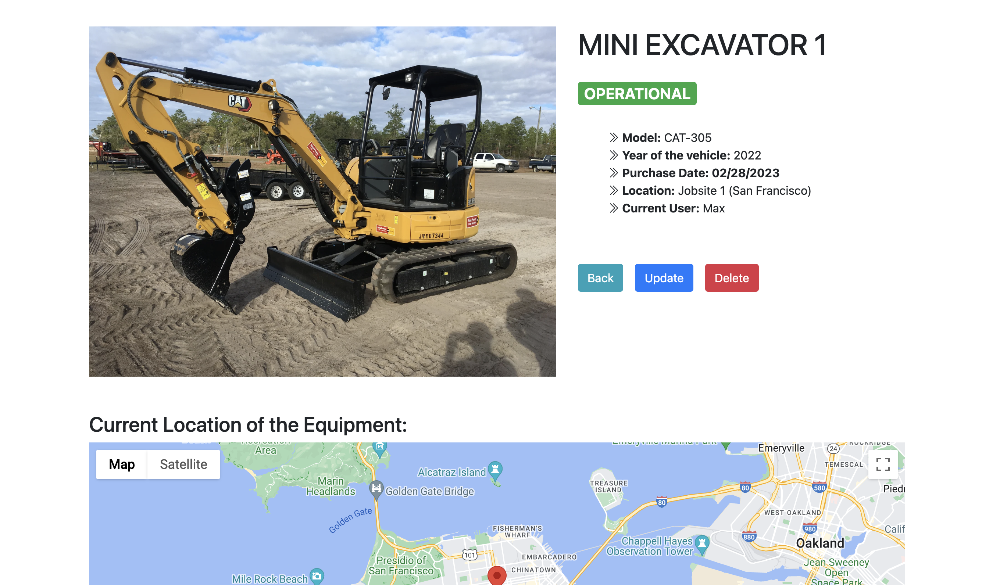
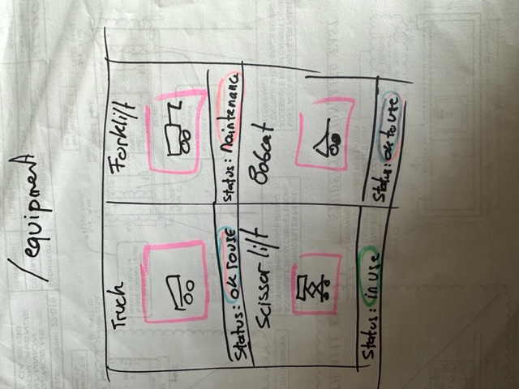

# The Equipment App

#### A full CRUD web app designed  for busy contractor looking at keeping track of their vehicle and equipment inventory .

## Description
My first full CRUD web app. I am a general contractor and I got the idea of this app when I had to request some specific equipment/vehicles delivered to my jobsite. My shop manager/mechanics is currently using an Excel spreadsheet to keep track of all the information and I thought it would be good to have an app that properly displays the status of the equipment 

## Table of Contents
* [Technologies Used](#technologiesused)
* [Features](#features)
* [Design](#design)
* [Project Next Steps](#nextsteps)
* [Deployed App](#deployment)
* [About the Author](#author)

## Technologies Used
* JavaScript
* HTML5
* CSS3
* Node.Js
* MongoDB
* Google Map API
* Express.js
* RESTful Routes

## Features
* Users can run full C.R.U.D. operation on the equiment model

## Whiteboard Images
* Sketches:

## Design
* Design elements implemented using Bootstrap and CSS3

## Project Next Steps
* Users will be able to upload their own images (Using Multer)
* Users will be able to manually enter locations in google map
* Admin user will have access to pricing/budget options and display

## Deployed Link
* [Heroku.com](https://my-equipment.herokuapp.com/)

* You can view the repository:
[Github.com](https://github.com/tavice/my-equipment)

* If unable to view please go live locally through VS Code

## About The Author
I build applications and mini projects tied to my various interests. I am trying to improve my daily activities by creating elegant code.

    
## Works Cited:
* N/A
